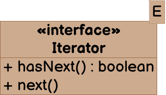

---
```java
/*
 * Copyright (c) 1997, 2018, Oracle and/or its affiliates. All rights reserved.
 * DO NOT ALTER OR REMOVE COPYRIGHT NOTICES OR THIS FILE HEADER.
 *
 * This code is free software; you can redistribute it and/or modify it
 * under the terms of the GNU General Public License version 2 only, as
 * published by the Free Software Foundation.  Oracle designates this
 * particular file as subject to the "Classpath" exception as provided
 * by Oracle in the LICENSE file that accompanied this code.
 *
 * This code is distributed in the hope that it will be useful, but WITHOUT
 * ANY WARRANTY; without even the implied warranty of MERCHANTABILITY or
 * FITNESS FOR A PARTICULAR PURPOSE.  See the GNU General Public License
 * version 2 for more details (a copy is included in the LICENSE file that
 * accompanied this code).
 *
 * You should have received a copy of the GNU General Public License version
 * 2 along with this work; if not, write to the Free Software Foundation,
 * Inc., 51 Franklin St, Fifth Floor, Boston, MA 02110-1301 USA.
 *
 * Please contact Oracle, 500 Oracle Parkway, Redwood Shores, CA 94065 USA
 * or visit www.oracle.com if you need additional information or have any
 * questions.
 */

package java.util;

import java.util.function.Consumer;

/**
 * An iterator over a collection.  {@code Iterator} takes the place of
 * {@link Enumeration} in the Java Collections Framework.  Iterators
 * differ from enumerations in two ways:
 *
 * <ul>
 *      <li> Iterators allow the caller to remove elements from the
 *           underlying collection during the iteration with well-defined
 *           semantics.
 *      <li> Method names have been improved.
 * </ul>
 *
 * <p>This interface is a member of the
 * <a href="{@docRoot}/java.base/java/util/package-summary.html#CollectionsFramework">
 * Java Collections Framework</a>.
 *
 * @apiNote
 * An {@link Enumeration} can be converted into an {@code Iterator} by
 * using the {@link Enumeration#asIterator} method.
 *
 * @param <E> the type of elements returned by this iterator
 *
 * @author  Josh Bloch
 * @see Collection
 * @see ListIterator
 * @see Iterable
 * @since 1.2
 */
public interface Iterator<E> {
    /**
     * Returns {@code true} if the iteration has more elements.
     * (In other words, returns {@code true} if {@link #next} would
     * return an element rather than throwing an exception.)
     *
     * @return {@code true} if the iteration has more elements
     */
    boolean hasNext();

    /**
     * Returns the next element in the iteration.
     *
     * @return the next element in the iteration
     * @throws NoSuchElementException if the iteration has no more elements
     */
    E next();

    /**
     * Removes from the underlying collection the last element returned
     * by this iterator (optional operation).  This method can be called
     * only once per call to {@link #next}.
     * <p>
     * The behavior of an iterator is unspecified if the underlying collection
     * is modified while the iteration is in progress in any way other than by
     * calling this method, unless an overriding class has specified a
     * concurrent modification policy.
     * <p>
     * The behavior of an iterator is unspecified if this method is called
     * after a call to the {@link #forEachRemaining forEachRemaining} method.
     *
     * @implSpec
     * The default implementation throws an instance of
     * {@link UnsupportedOperationException} and performs no other action.
     *
     * @throws UnsupportedOperationException if the {@code remove}
     *         operation is not supported by this iterator
     *
     * @throws IllegalStateException if the {@code next} method has not
     *         yet been called, or the {@code remove} method has already
     *         been called after the last call to the {@code next}
     *         method
     */
    default void remove() {
        throw new UnsupportedOperationException("remove");
    }

    /**
     * Performs the given action for each remaining element until all elements
     * have been processed or the action throws an exception.  Actions are
     * performed in the order of iteration, if that order is specified.
     * Exceptions thrown by the action are relayed to the caller.
     * <p>
     * The behavior of an iterator is unspecified if the action modifies the
     * collection in any way (even by calling the {@link #remove remove} method
     * or other mutator methods of {@code Iterator} subtypes),
     * unless an overriding class has specified a concurrent modification policy.
     * <p>
     * Subsequent behavior of an iterator is unspecified if the action throws an
     * exception.
     *
     * @implSpec
     * <p>The default implementation behaves as if:
     * <pre>{@code
     *     while (hasNext())
     *         action.accept(next());
     * }</pre>
     *
     * @param action The action to be performed for each element
     * @throws NullPointerException if the specified action is null
     * @since 1.8
     */
    default void forEachRemaining(Consumer<? super E> action) {
        Objects.requireNonNull(action);
        while (hasNext())
            action.accept(next());
    }
}
```
